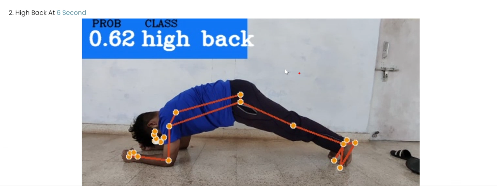
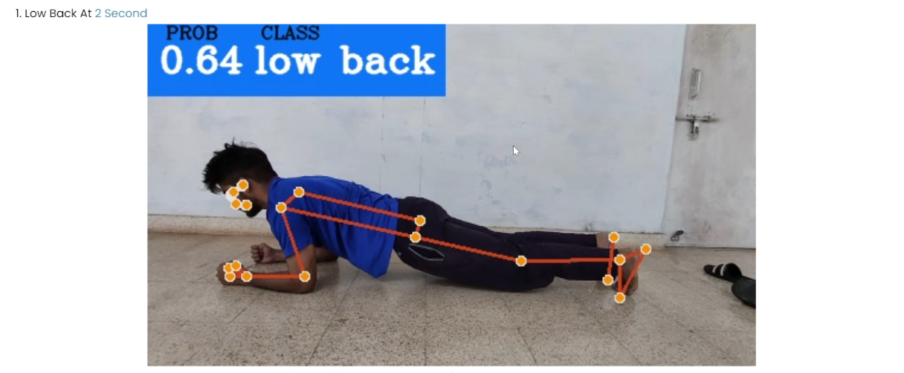
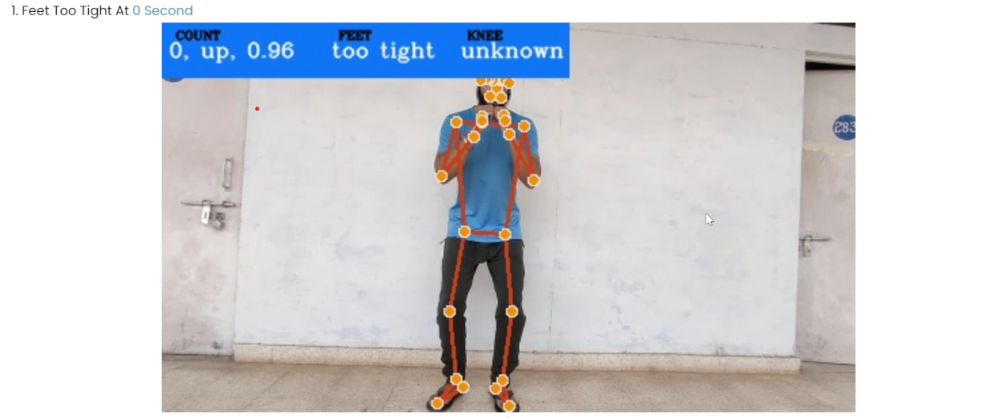
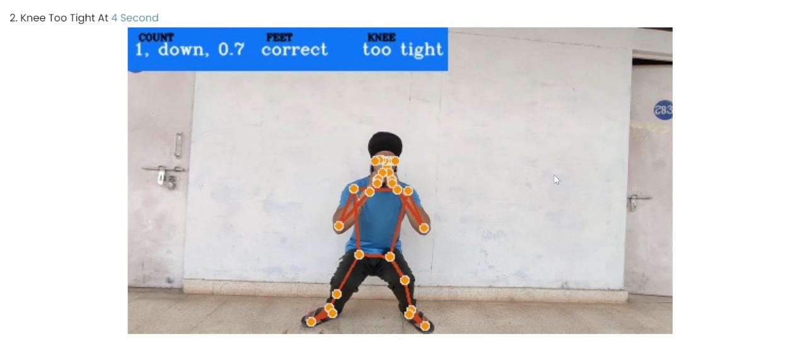

# Exercise-Correction

Developed an advanced exercise correction system using computer vision and deep learning techniques. The system provides real-time feedback on common exercises (Plank, Squat) by analyzing user video inputs and detecting incorrect movements.

## Features

- **Real-Time Feedback**: Instant feedback on exercise performance.
- **Exercise Detection**: Detects common exercises like Plank and Squat.
- **Movement Analysis**: Identifies incorrect movements and provides correction suggestions.
- **User-Friendly Interface**: Simple and easy-to-use interface for real-time monitoring.

## Installation

### Prerequisites

Ensure you have the following installed:

- Python 3.x
- pip (Python package installer)
- OpenCV
- TensorFlow or PyTorch (depending on your choice)
- Other required dependencies listed in `requirements.txt`

### Setup

1. Clone the repository:
    ```bash
    git clone https://github.com/your-username/Exercise-Correction.git
    ```
2. Navigate to the project directory:
    ```bash
    cd Exercise-Correction
    ```
3. Install the required dependencies:
    ```bash
    pip install -r requirements.txt
    ```

## Usage

To run the exercise correction system:

1. Start the system by running the main Python script:
    ```bash
    python main.py
    ```
2. Upload a video or use the webcam to demonstrate an exercise.
3. The system will provide real-time feedback based on the detected movements.

### Example

Here is an example of how the system detects a Plank exercise:









## Contributing

1. Fork the repository.
2. Create a new branch (`git checkout -b feature-branch`).
3. Commit your changes (`git commit -m 'Add new feature'`).
4. Push to the branch (`git push origin feature-branch`).
5. Open a pull request.

## License

This project is licensed under the MIT License - see the [LICENSE](LICENSE) file for details.
